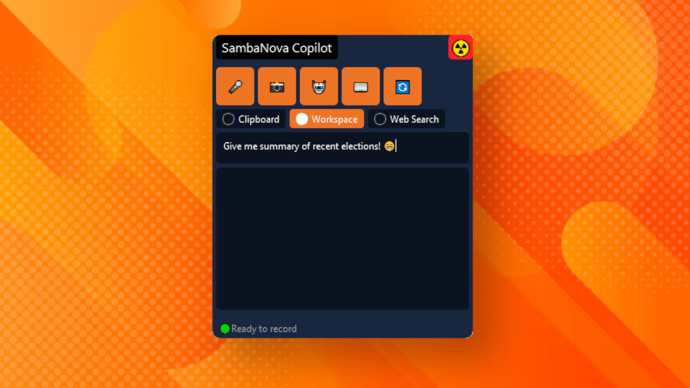
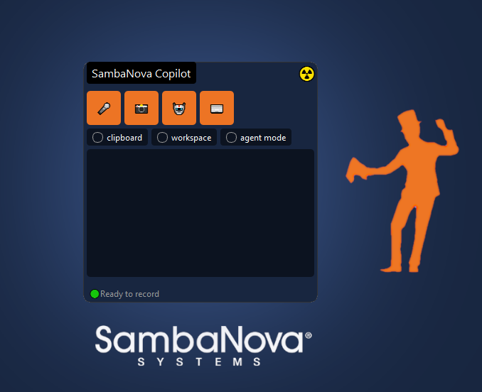
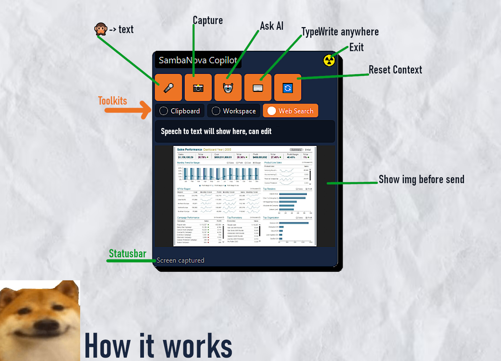
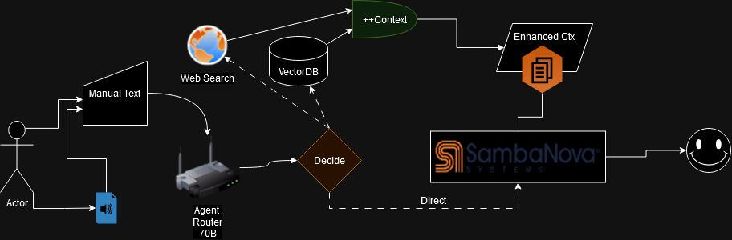
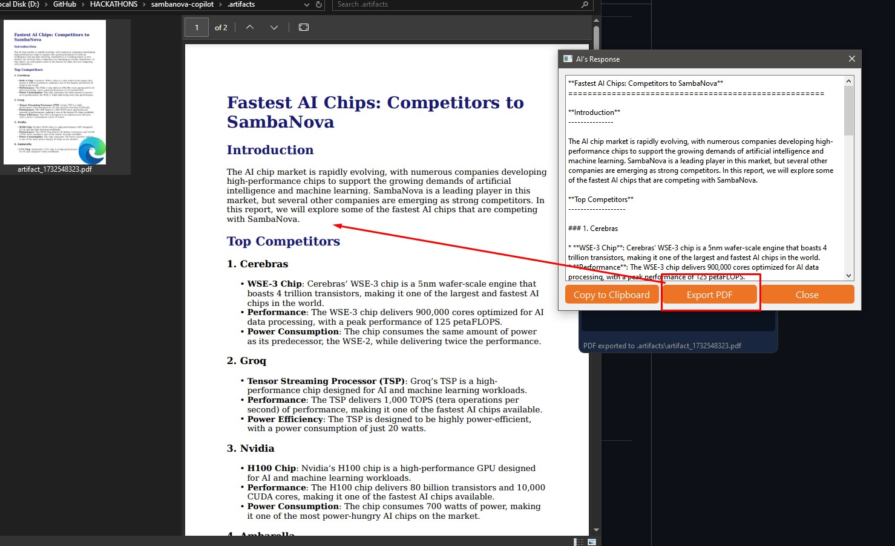
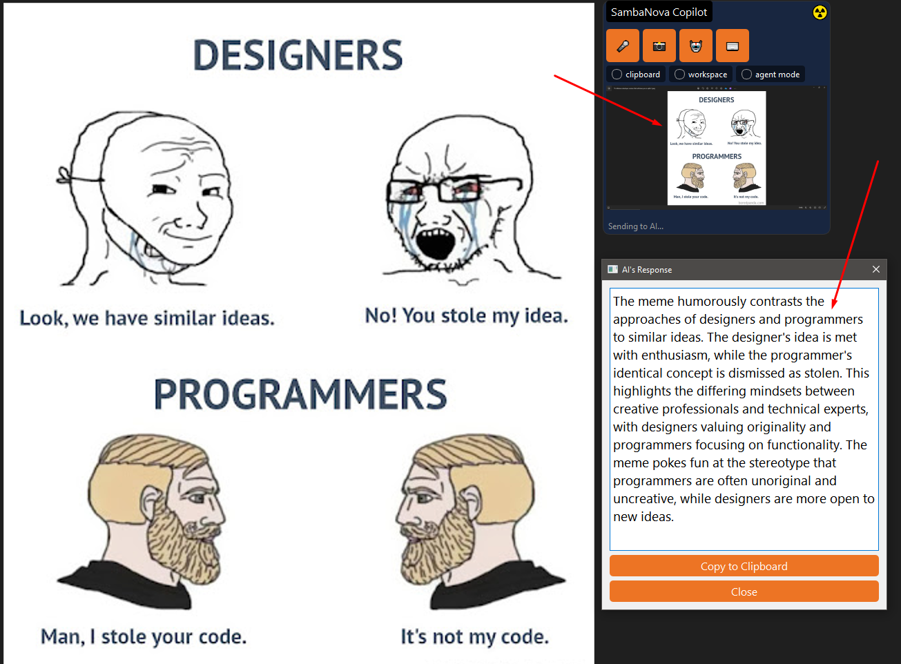

# Swamix Copilot : Agent Storm Generator

[🎥Watch Video Demo](https://youtu.be/ZITFUoB8b-k)

This Copilot is highly customizable multi purpose with agentic capabilities, which assists user based on their personalized queries primarily with verbal query, jarvis style. 

It can be used for a variety of tasks such as 
- Note Taker/Maker, with speech to text
- meme explainer, OCR image to text
- document analysis, presentations exporter
- realtime online conference support, 
- content writing, translation, quick web research
> to keep this list small, what you can do with a mouth, eyes, hands and secondary brain, you can do with this copilot. 

Currently a hackathon proof of concept, but can be extended to a full fledged product. please open issue and tell us what you do, we will add functionality carefully so it may benefit people who do same task as you!

Features a plug-n-play architecture with many batteries included so a user can easily add or remove features as per their needs (you can keep as light or as heavy).

-   BYOM : Bring your own model / finetune
-   BYOT : Bring your own tools (Agent)
-   BYOC : Bring your own context / data
-   BYOP : Bring your own prompt / template

# Gallery

<!-- insert a assets/flowchart.png -->

 


## Quick Start

### Option 1 : Standard

first clone repo to a folder:

```
git clone https://github.com/nikhil-swamix/sambanova-copilot.git
cd sambanova-copilot
pip install -r requirements.txt
python copilot.py

```

Try to directly run the run\__.ps1 or .sh. here _ is platform. it will install dependencies and run the app. run 2 times if it fails the first time, (troubleshoot tip).

### Option 2 : Easiest (windows):
[download fow win](https://github.com/nikhil-swamix/sambanova-copilot/releases)
Go to releases section and download the executable, and double click! 

### Option 3 : Preferred (poetry):

[Get Poetry](https://python-poetry.org/docs/#installing-with-the-official-installer)

```
# Cd to directory after git clone
git clone https://github.com/nikhil-swamix/sambanova-copilot.git
cd sambanova-copilot
poetry install
poetry run python copilot.py
```

A great care has been taken to make it distributable and easy to use, please open issue in repo if any encountered.

## Requirements

make sure you have SAMBANOVA_API_KEY, GROQ_API_KEY , configured in .env , some keys are provided.

---

# How it works

## Frontend



## Backend



---

# SambaNova Copilot Guide

## How to Use

-   Press 1 (🎤) - Start/stop voice recording
-   Press 2 (📸) - Capture current screen
-   Press 3 (🤖) - Send to AI for processing, it will show response in dedicated popup
-   Press 4 (⌨️) - Auto-type response (100 chars/sec)
-   Toggle Clipboard - Use copied text as additional context
-   Toggle Workspace - Reference local documents
-   Toggle Web Search - Include internet results
-   Reset (🔄) - Clear current session data

## Example Use Cases (can extend with plugins)

-   Code Review: Screenshot code + voice ask "explain this code"
-   Meeting Notes: Record conversations for instant transcription and summary
-   Meme Explainer: Capture meme image + ask for cultural context
-   Document Analysis: Screenshot text + ask for key points summary
-   Technical Support: Capture error screen + ask for solutions
-   Content/Blog Writing: Dictate rough ideas for AI enhancement
-   Translation Helper: Record foreign language for translation and tips
-   Quick Research: Combine clipboard articles + voice questions
-   UI/UX Review: Screenshot designs for instant feedback
-   Email Assistant (with plugin): Dictate main points for professional email drafts

Pro Tip: Combine voice + image + clipboard for best results

## Useful Features



-   generate executive reports after scanning few webpages, Save Generated content to PDF/Markdown (artifacts)
-   Does not require API for web search, use local browser for free search! (msedge, chrome, firefox) !
-   Can use local documents as context for better results
-   Can use clipboard text as additional context
-   Can use voice recording as primary instruction.
-   Automatic Tool Decision Based on user query (Agentic/Smart Mode) (Experimental, please comment out code if any issue)

# Highlights



<details>
  <summary>Configuration help</summary>

KEYS_WILL_BE_DELETED_POST_HACKATHON_DATE recommended to get your own keys, these keys are in .env file

##### SAMBANOVA_API_KEY_HELP

    https://cloud.sambanova.ai/apis

##### GROQ_API_KEY_HELP

    Used for text to speech
    https://console.groq.com/keys

##### VOYAGE_API_KEY_HELP

    https://dash.voyageai.com/api-keys

##### WORKSPACE_DIR_HELP


</details>


## Upcoming

-   Reasoning mode (some challenge with llama to act as thinker, in progress)
-   Save history and submit to SambaStudio finetune job so model just "gets it"
-   ui based prompt editor , add remove rules in system prompt on the fly
-   Share json backed OPEN API compatible Workflows using "SambaHub" maybe.

# (un)Known Issues

-   Please open issues if any encountered. will be added and try to resolve.
